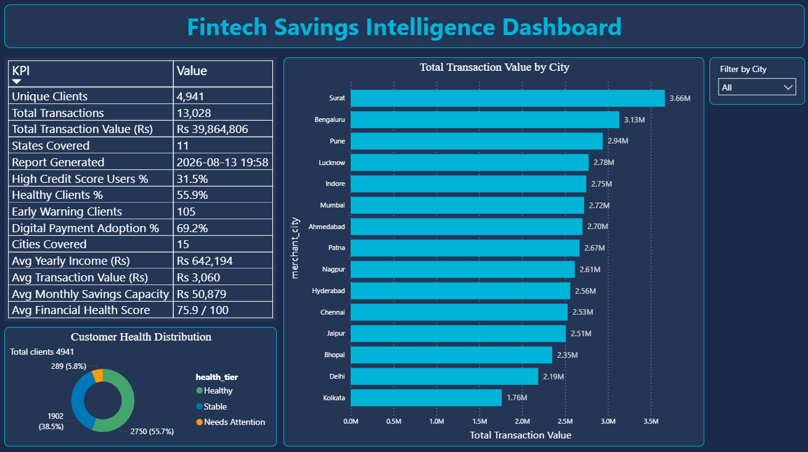
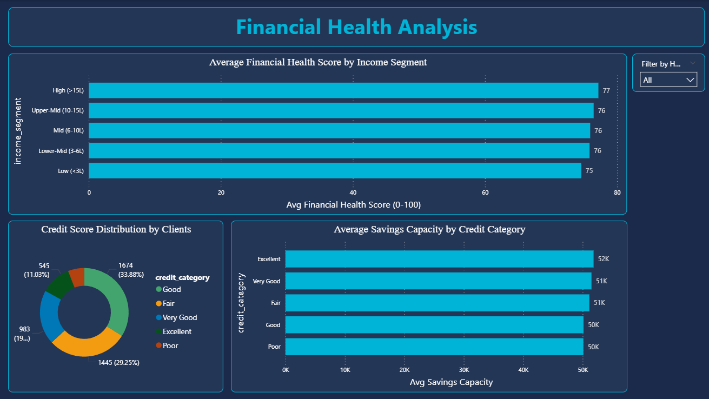
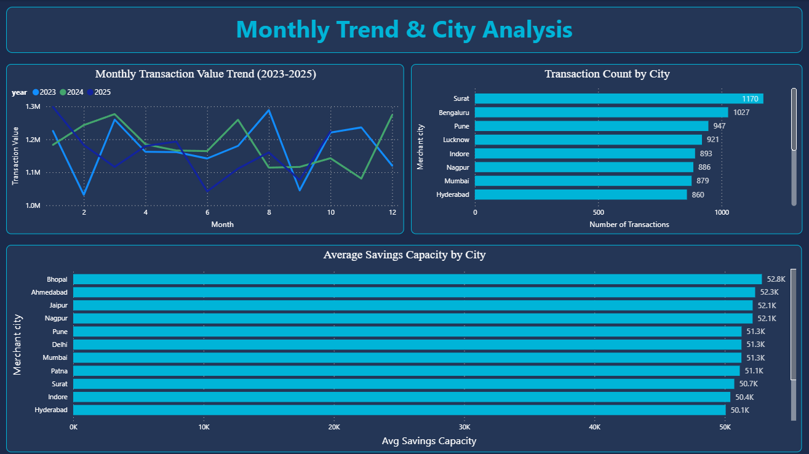
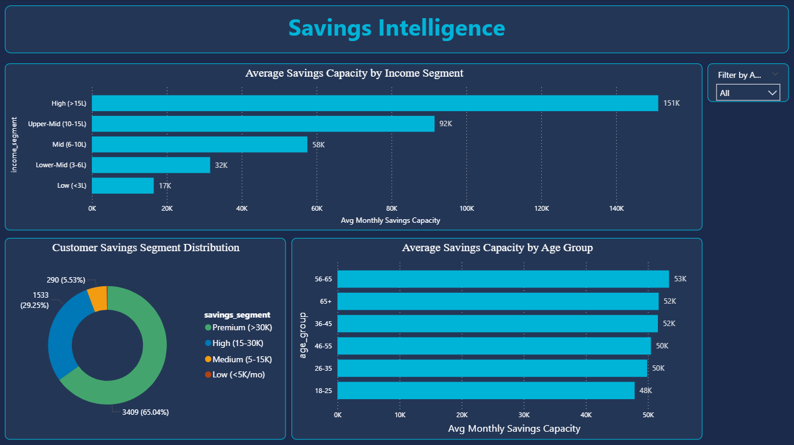
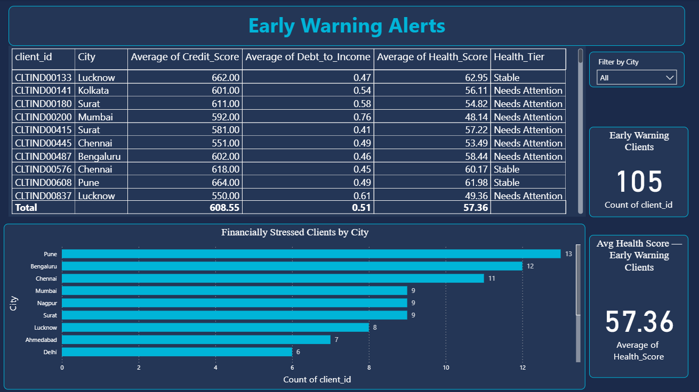
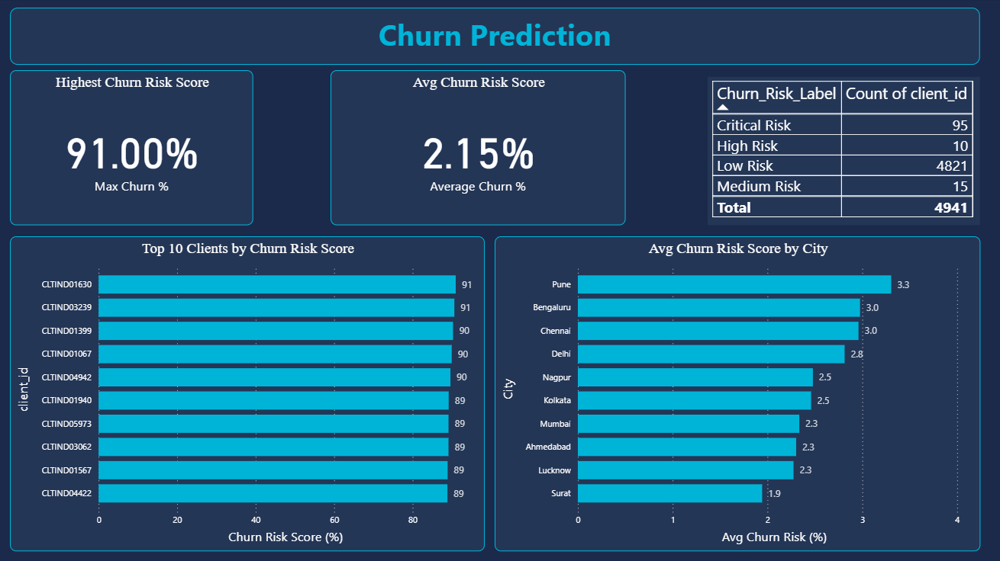

# Fintech Savings Intelligence Pipeline
## Automated Python + Power BI Analytics System

## Project Overview
End-to-end automated financial intelligence pipeline
built for micro-savings fintech platforms.
Processes 20,000 customer transactions across 4,941
clients in 15 Indian cities — delivering automated
KPI reporting, financial health scoring, anomaly
detection, and ML churn prediction via a 6-page
auto-refreshing Power BI dashboard.

**Tools:** Python | Power BI | scikit-learn | Windows Task Scheduler
**Dataset:** 20,000 transactions | 4,941 clients | 15 cities | 11 states
**Automation:** Pipeline runs daily at 8 AM via Task Scheduler

---

## Dashboard Preview

### Page 1 — Executive Overview

### Page 2 — Financial Health Analysis

### Page 3 — Monthly Trend & City Analysis

### Page 4 — Savings Intelligence

### Page 5 — Early Warning Alerts

### Page 6 — Churn Prediction

---

## Key Business Insights
- 55.9% of clients are in Healthy financial tier
- 105 Early Warning clients identified proactively
- 95 Critical Risk churn candidates flagged
- 2.15% average churn probability across user base
- Highest individual churn risk: 91%
- Jaipur has highest average savings capacity
- Pune has most financially stressed clients
- Surat leads in total transaction value

## Financial Health Score Algorithm
Custom composite scoring model:

- Credit Score — 50% weight
- Debt-to-Income Ratio — 30% weight
- Income Level — 20% weight
- Output: Score from 0 to 100

## ML Churn Prediction
- Algorithm: Random Forest Classifier (100 trees)
- Features: 7 financial indicators
- Train/Test split: 80% / 20%
- Risk categories: Low / Medium / High / Critical

## Technical Stack
| Component | Technology |
|-----------|-----------|
| Data Processing | Python (pandas, numpy) |
| Machine Learning | scikit-learn |
| Visualisation | Power BI (DAX, Power Query) |
| Automation | Windows Task Scheduler |
| Output Format | Excel (11 sheets) |
| Version Control | Git / GitHub |

## Repository Structure
- scripts/ — Main automation pipeline
- notebooks/ — EDA and insights notebook
- data/raw/ — Source dataset
- dashboard/ — Dashboard screenshots
- pipeline_log.txt — Daily execution log

## Author
Santanu Sarkar
IIT Guwahati M.Tech Alumni | Data Analyst
LinkedIn: linkedin.com/in/santanu-sarkar-data-analyst
GitHub: github.com/shaan7029
